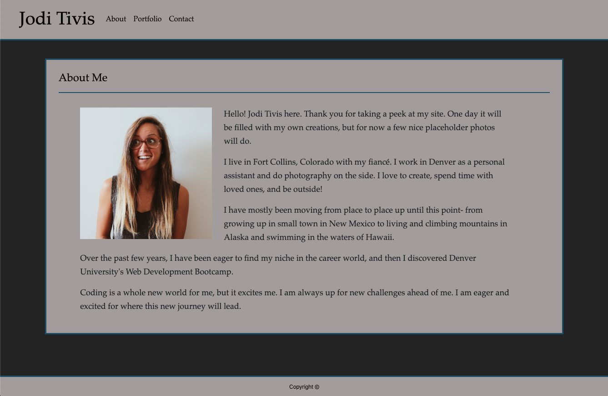
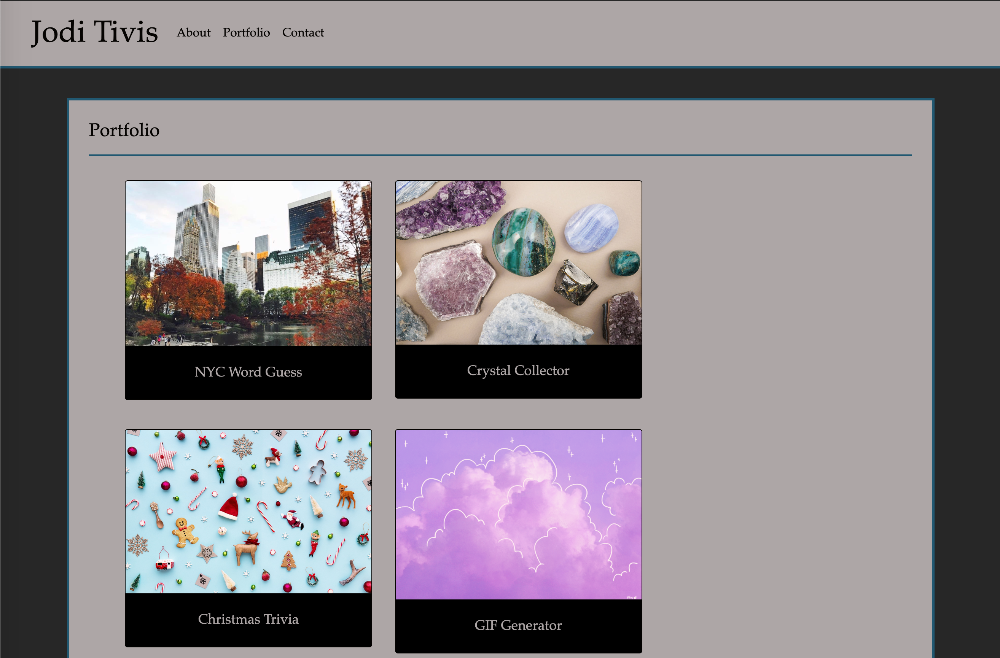
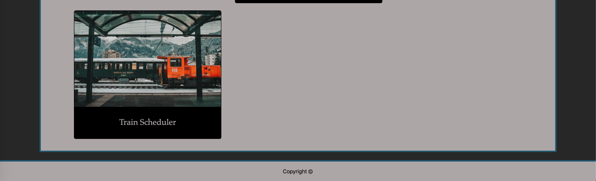
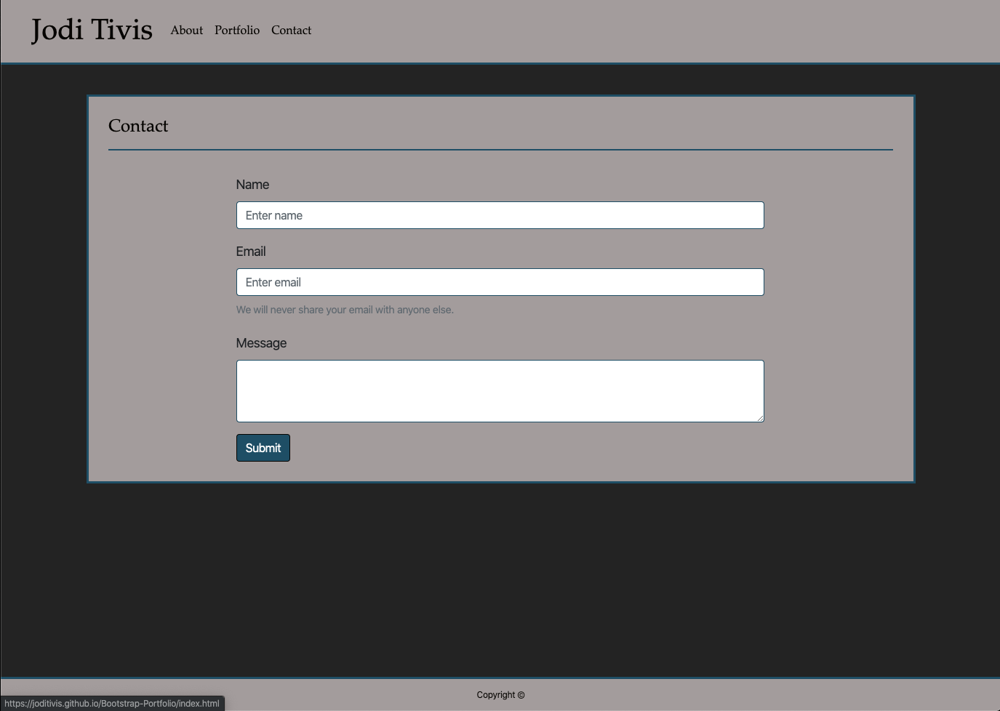

# Bootstrap-Portfolio

 __Link to Webpage: https://joditivis.github.io/Bootstrap-Portfolio/__

# About:
University of Denver Coding Boot Camp second week assignment: Required the use of Bootstrap to format the layout and style of our Student Portfolio.

__Tools + Languages Used:__

* HTML5
* Bootstrap CSS (getbootstrap.com)
* Custom CSS
  -> media queries used within Custom CSS for a responsive and functioning sight for any viewport 

---
__Folder + File Structure Used:__

Bootstrap-Portfolio Folder
  1. index.html
  2. portfolio.html
  3. contact.html
    
assets Folder
  1. css folder -> custom.css
  2. images folder -> all image files kept here

---
# Page Features:
## About:

## Portfolio:
* Portfolio Page contains completed homework assignments

## Contact:

