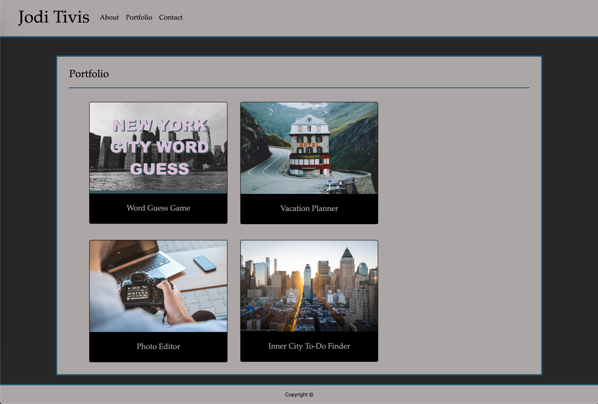

# Bootstrap-Portfolio

 __Link to Webpage: https://joditivis.github.io/Bootstrap-Portfolio/__

__Tools/Languages Used:__
```
- HTML5
- Bootstrap CSS (getbootstrap.com)
- Custom CSS
  -> media queries used within Custom CSS for a responsive and functioning sight for any viewport 
```

---
__Folders + Files Used to Format Each Page:__
```
Bootstrap-Portfolio Folder
  1. index.html
  2. portfolio.html
  3. contact.html
    -- assets Folder
      1. css folder -> custom.css
      2. images folder -> all image files kept here
```
Placeholder images found on https://unsplash.com/

---
# Page Features:
## About:


## Portfolio:


## Contact:


---

## Contributors:

- Jodi Tivis
